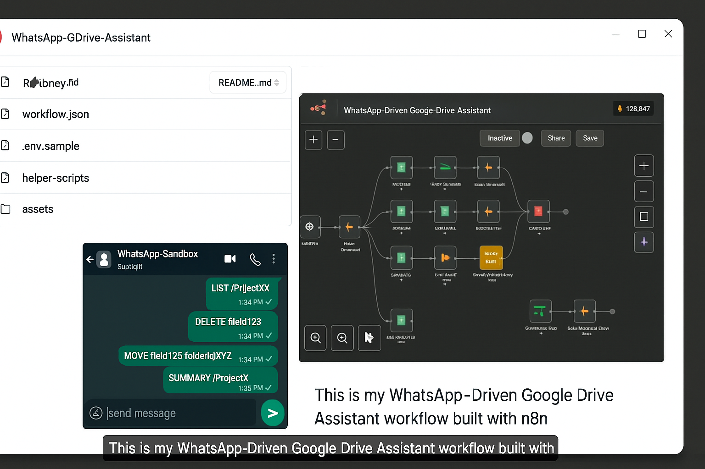

## WhatsApp-Driven Google Drive Assistant (n8n workflow)

[](https://github.com/Subhajit75/WhatsApp-Driven-Google-Drive-Assistant-n8n-workflow-/actions/workflows/ci.yml)


This project is an AI-powered WhatsApp Assistant that integrates with Google Drive to perform file management tasks and generate document summaries directly via WhatsApp.

It is built using n8n, Twilio WhatsApp API, Google Drive API, and OpenAI GPT-4o.

---

## 🚀 Features

- **WhatsApp Commands to interact with Google Drive**:
  - `LIST /ProjectX` — List all files in the specified folder.
  - `DELETE /ProjectX/report.pdf` — Delete the specified file.
  - `MOVE /ProjectX/report.pdf /Archive` — Move the file to another folder.
  - `SUMMARY /ProjectX` — Summarize all documents (PDF/DOCX/TXT) in the folder.
- **AI Summarization** of document content using **OpenAI GPT-4o**.
- **Error Handling & Safety Checks** to prevent accidental/mass deletion.
- **Audit Logging** in Google Sheets or local logs.
- **Extensible Design** to add new commands easily.

---
## 📂 File Structure 
```bash 
WhatsApp-GDrive-Assistant/
├── .github/
│ └── workflows/
│  └── ci.yml # CI workflow for GitHub Actions
│
│── assets/
│   ├── workflow-diagram.png    # Optional workflow screenshot
│   └── demo-video.mp4           #Demo video
│
├── helper-scripts/
│   ├── summarizeDoc.js         # Optional: For custom doc parsing
│   └── formatReply.js          # Optional: Helper for WhatsApp reply
│
├── .env.sample                 # Sample environment variables
├── LICENSE                     # MIT License
├── README.md                  # Full project documentation
└── workflow.json               # Ready-to-import n8n workflow
```


---
## ⚡ Setup Instructions

### 1️⃣ Prerequisites

Make sure you have the following configured:

- **n8n** (Cloud, Self-Hosted, or Docker)
- **Twilio Account** with WhatsApp Sandbox enabled
- **Google Cloud Project** with **Google Drive API** enabled
- **OpenAI Account** with **GPT-4o API** access

---

### 2️⃣ Environment Variables

1. Copy the sample environment file: ***Copy .env.sample***

```bash
cp .env.sample .env
```

### 3️⃣ Import Workflow in n8n

1. Open your **n8n** editor.
2. Go to **Menu → Import from File**.
3. Select the `workflow.json` file from this repository.
4. Update credentials for:
   - **Twilio API**
   - **Google Drive OAuth2**
   - **OpenAI API**
5. **Save** and **activate** the workflow.

---
## Twilio Sandbox

Follow these steps to set up Twilio WhatsApp Sandbox for this project:

### **1. Create a Twilio Account**
1. Go to [Twilio Sign Up](https://www.twilio.com/try-twilio) and create a free account.  
2. Verify your **email** and **phone number**.  
3. You will get **$15.50 trial credit** for testing.  


### **2. Enable WhatsApp Sandbox**
1. Go to: [Twilio WhatsApp Sandbox](https://www.twilio.com/console/sms/whatsapp/learn)  
2. You will see a **Sandbox Number**, e.g.: whatsapp:+91 ******2502

### **3. Join the Sandbox**
1. Open WhatsApp on your phone.
2. Send the join code to the sandbox number:

```bash
join sweet-dog
```
3. Twilio will confirm that your number is connected to the Sandbox.

### **4. Configure Webhook URL**
1. Go to Twilio Console → Messaging → WhatsApp Sandbox Settings.
2. In “When a message comes in”, set your n8n webhook URL:

```arduino
https://YOUR_N8N_DOMAIN/webhook/whatsapp
```
3. Click Save.

### **5. Test the Integration**
1. Open WhatsApp and send a command to your Twilio Sandbox:
2. Your n8n workflow should trigger and respond with the Google Drive results.

 **Notes**
- Sandbox only works with **verified numbers** in trial mode.  
- In trial mode, messages can be sent **only to your verified number**.  
- For production, apply for **WhatsApp Business API approval**.

### 5️⃣ Docker Deployment
- If you want to run locally with Docker:

```bash
docker run -it --rm \
  -p 5678:5678 \
  -v ~/.n8n:/home/node/.n8n \
  --env-file .env \
  n8nio/n8n
```
- Access n8n at http://localhost:5678.

---

## Google Credentials

This project requires access to Google Drive to **list, move, delete, and summarize files**.  
Follow the steps below to create and connect your credentials in n8n.


### **1. Google Credentials console

To use the workflow, create Google OAuth2 credentials:

1. Go to [Google Cloud Console](https://console.cloud.google.com/).
2. Create a new project → Enable **Google Drive API**.
3. Navigate to **APIs & Services > Credentials**.
4. Click **Create Credentials → OAuth client ID**.
5. Set type to **Web Application**.
6. Add your `n8n` callback URL (from your cloud instance or localhost).
7. Download the JSON and configure it in n8n under **Google Drive OAuth2** credentials.


### **2. Enable Google Drive API**
1. In the Google Cloud Console, select your project.  
2. Navigate to **APIs & Services → Library**.  
3. Search for **Google Drive API** and **Enable** it.


### **3. Create OAuth 2.0 Credentials**
1. Go to **APIs & Services → Credentials → Create Credentials → OAuth Client ID**.  
2. If prompted, **Configure Consent Screen** first:
   - Select **External** (for testing)  
   - Fill **App Name**, **User Support Email**, and **Developer Email**  
   - Save & Continue
3. Create the OAuth client:
   - **Application Type** → `Web Application`  
   - **Authorized Redirect URIs** → Add your n8n OAuth redirect URL:
     ```
     https://YOUR_N8N_DOMAIN/rest/oauth2-credential/callback
     ```
4. Click **Create** and note down your:
   - **Client ID**  
   - **Client Secret**


### **4. Connect Google Drive in n8n**
1. Open your **n8n Editor**.  
2. Go to **Credentials → Add New → Google Drive OAuth2 API**.  
3. Enter:
   - **Client ID**  
   - **Client Secret**  
   - **OAuth2 Scope** → `https://www.googleapis.com/auth/drive`  
4. Click **Connect OAuth2 Account** and authorize your Google Account.  


### **5. Test Your Connection**
- Use the **List Files** node in n8n and set credentials to your new **Google Drive OAuth2**.  
- Execute the node to confirm that files from your Google Drive appear.

**Notes**
- Use a **separate Google Account** for testing to avoid accidental file deletions.  
- Ensure your n8n instance is **HTTPS-enabled** (required for Google OAuth2).  
- For production, configure **OAuth consent screen** and publish your app.

---

## Command Syntax

Send the following commands via WhatsApp to the Twilio Sandbox number (e.g., `+14155238886`) to interact with your Google Drive:

### **1. List Files in a Folder**
```
LIST /FolderName
```
 **Response:**   
- report.pdf
- summary.docx
- otes.txt
  
### **2. Delete a File**
```
DELETE /FolderName/FileName
```
 **Response:**  
File deleted successfully!

### **3. Move a File**
```
MOVE /SourceFolder/FileName /TargetFolder
```

 **Response:**  
File moved successfully!


### **4. Summarize Files in a Folder**
```
SUMMARY /FolderName
```

 **Response:**  
- report.pdf → Quarterly revenue report summary
- summary.docx → Key project highlights
- notes.txt → Meeting notes overview


  **Safety Notes**
- Commands are **case-insensitive** but are shown in **UPPERCASE** for clarity.  
- Avoid spaces in folder or file names if possible; use underscores or rename your files.  
- Deleting files may require confirmation to prevent accidental deletion (can be implemented in n8n Function nodes).

---
## Slash-Command Help

To get a list of available commands at any time, simply send:
```
HELP
```
**or**
```
/help
```
You will receive a reply like:

📌 WhatsApp Google Drive Assistant Commands:

/list <FolderName> → List all files in the folder

/delete <Folder/File> → Delete a specific file

/move <Src/File> <Dest> → Move file to another folder

/summary <FolderName> → Summarize all files in a folder

/help → Show this help menu


 **Tips**
- Commands can also work **without the leading slash**, e.g., `LIST ProjectX`.  
- Adding a **slash** makes it easier to identify commands and differentiate from casual text.  
- You can extend this workflow to support more commands like `/rename`, `/upload`, etc.

---
## Natural-Language Parser

Instead of requiring strict commands like `LIST /ProjectX`,  
you can allow **casual, human-like instructions** using a Natural Language Parser.


### **1. How it Works**
1. User sends a message like:
Can you show me all files in ProjectX?

2. A **Function node** in n8n or an **OpenAI node** interprets the text:
- Detects **intent** → `LIST`  
- Extracts **target folder** → `/ProjectX`  
3. Workflow continues as if the user had sent `LIST /ProjectX`.


### **2. Example Function Node Code**
```js
// Input: WhatsApp message in $json["Body"]
const msg = ($json["Body"] || "").toLowerCase();

if (msg.includes("list") || msg.includes("show")) {
return [{ command: "LIST", args: msg.match(/project\w*/i)?.[0] || "/" }];
}

if (msg.includes("delete") || msg.includes("remove")) {
const file = msg.match(/(\w+\.\w+)/)?.[0] || "";
return [{ command: "DELETE", args: file }];
}

if (msg.includes("move") || msg.includes("transfer")) {
const parts = msg.split(" to ");
return [{
 command: "MOVE",
 args: `${parts[0].match(/(\w+\.\w+)/)?.[0] || ""} ${parts[1] || ""}`
}];
}

if (msg.includes("summary") || msg.includes("summarize")) {
return [{ command: "SUMMARY", args: msg.match(/project\w*/i)?.[0] || "/" }];
}

// Default to HELP
return [{ command: "HELP", args: "" }];
```
3. Example Conversations:

- User: Can you show me files in ProjectX?
  
    - Bot: • report.pdf • notes.txt • summary.docx

- User: Please delete report.pdf in ProjectX
  
    - Bot: File deleted successfully!

- User: Move report.pdf to Archive folder
  
    - Bot: File moved successfully!

- User: Summarize the ProjectX folder
  
    - Bot: • report.pdf → Quarterly report summary...

---
## Webhook-Secured Endpoint

By default, n8n webhooks (like `/webhook/whatsapp`) are **public**.  
Anyone who knows the URL can trigger your workflow.  
To **secure your webhook**, follow these steps: 

### 1. Add a Secret Path

1. Open your **Webhook node** in n8n.  
2. Change the **Path** from:`whatsapp`

to:
```
whatsapp/SECRET_KEY
```
3. Update your **Twilio Webhook URL** in the Twilio console:
```
https://<your-n8n-domain>/webhook/whatsapp/mySecureKey123
```
### 2. Require a Token in Query or Header

You can also require that each request includes a **secret token**.

Example webhook URL with query token:
```
https://<your-n8n-domain>/webhook/whatsapp?token=MY_SECRET
```

In n8n, add a **Function Node** right after the Webhook node:

```javascript
const token = $json.query?.token;
if (token !== $env.WEBHOOK_SECRET) {
  throw new Error("Unauthorized request");
}
return $json;
```
Add the secret to your .env file: `WEBHOOK_SECRET=MySecureKey123`

## 3. Twilio Signature Verification (Advanced)
Twilio signs each incoming webhook request.
You can verify it for maximum security.

Capture the X-Twilio-Signature header.

Use Node.js crypto to verify:

```javascript
const crypto = require("crypto");

const authToken = $env.TWILIO_AUTH_TOKEN;
const signature = $json.headers["x-twilio-signature"];
const url = "https://<your-n8n-domain>/webhook/whatsapp";
const params = $json.body;

// Generate expected signature
const expected = crypto.createHmac("sha1", authToken)
                       .update(url + JSON.stringify(params))
                       .digest("base64");

if (expected !== signature) {
  throw new Error("Invalid Twilio signature");
}

return $json;
```

---
## 🧮 Workflow Diagram

Here’s an overview of the WhatsApp-Driven Google Drive Assistant workflow:



---

## 📫 Contact

<div align="center">

[](mailto:subhajitghosh7590@gmail.com)
[](https://www.linkedin.com/in/subhajit-ghosh-75s90g/)
[](https://github.com/Subhajit75)

</div>

## 📜 License

MIT License © 2025 [Subhajit Ghosh](https://www.linkedin.com/in/subhajit-ghosh-75s90g/)

---

<div align="center">
  
Made by [Subhajit Ghosh](https://www.linkedin.com/in/subhajit-ghosh-75s90g/)  

</div>
